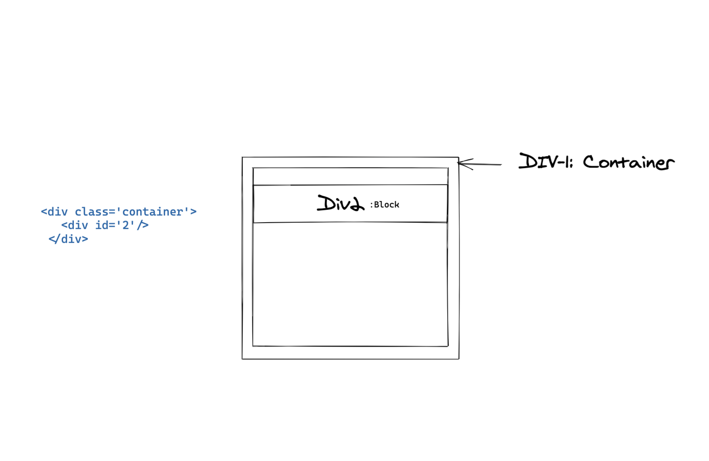
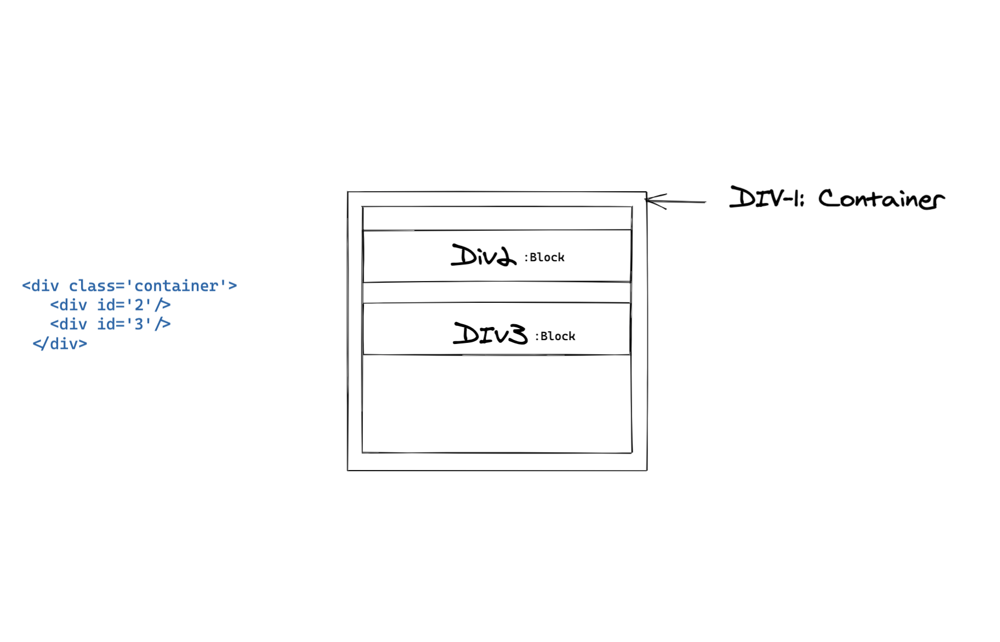
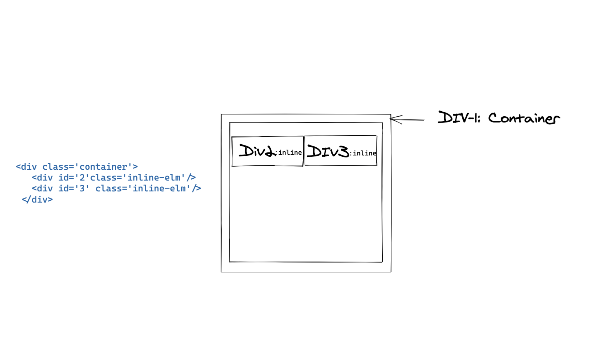
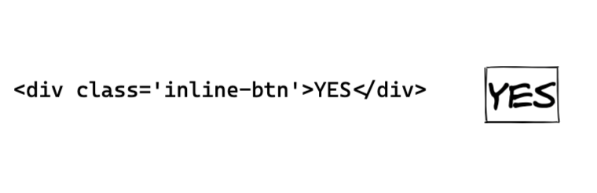
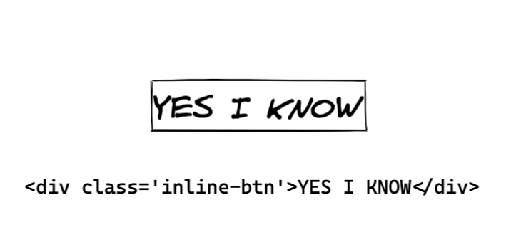
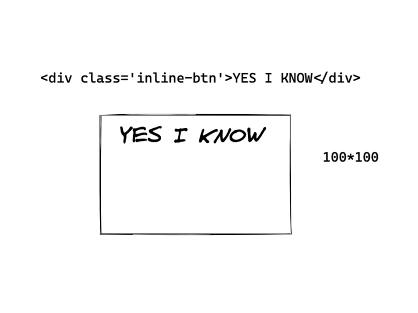
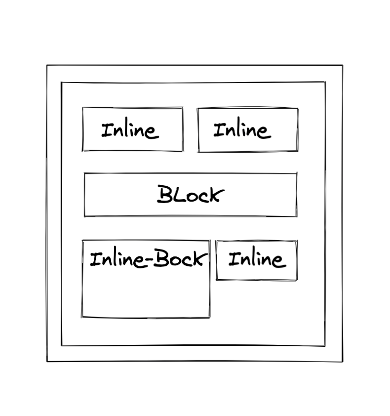

---

title: The display property
date: "22nd August 2020"
description: "The display property"

---

Often times when you are performing some repitive task, you get comfortable with what it is and fail to find a better - more optimal solution. Or, you overlook some very basic concepts and remain content with the outcome you produce.

I am at the end of my two year journey as a web developer and you might expect me to have the right answer when asked about the difference between div-inline, inline and block. I did not have the right answer up until NOW.

## `display` property.

The display property specificies the display behavior of an element. It’s a must know for controlling the layout of an element.
There’s a bunch of property values. By default the listed elements have `block` as their property value.

- div
- h1
- p
- li
- section
  

A block element starts from a new line and will occupy the whole width of it's wrapping container.
DIV2 above takes up the whole width.

## `display:inline`

Now lets say that you want to place another div element next to DIV2.
Lets do that:


Tada, that won't work.
Let's assign a `class='inline-elm'` to both DIV2 and DIV3 and add the following css property:

```
inline-elm{
   display:'inline'
}
```



The inline property displays an element as an inline element. In other words, inline elements do NOT start on a new line and only take up as much width as its content.

As much width as its content ?
Let me explain: Using div as a button type component.

```
.inline-btn{
    display:'inline'
    border:'1px solid black'
}
```



You don't like that.



YES I KNOW, this is the content, an `inline` element will acquire as much width as its content. Hope it's clear now.
To fix this, can we do something like this ?

```
.inline-btn {
  display: inline;
  width: 100px; /* ❌ won't have any effect */
  height: 100px; /* ❌ won't have any effect */
}
```

No we can't, width and height property has no effect on inline elements.
How to solve this now ?

## `display:inline-block`

Introducing `inline-block`. Displays an element as an inline-level block container. You CAN set height and width values.

```
.inline-btn {
  display: inline-block;
  width: 100px; /* ✅  yes, it will work */
  height: 100px; /* ✅  yes, it will work */
}
```

It’s essentially the same thing as inline, except that you can set height and width values.


## Explained in Non-Dev terms: [Inspired from external source]

Imagine if you're at a movie theatre, you have rows of seats, right. If you assign your friend with an inline seat, they will sit next to you. So the thing with inline seats is that they all are the same physical chair. You can't manipulate the chair to make it larger or smaller. One size fits all they call it!

Now your friend Charlie wants to join you, but because she is the daughter of the owner of the theatre. She gets assigned an inline-block seat. Well, she still gets to sit next to you. Cause she's "inline" with you (bad pun, lol 😂) and of course you want her to sit next to you. However, because she is the daughter of the owner of the theatre, her mom wants to make sure she's comfortable. So she gives her a special seat, where her chair is customized and can be adjusted to make it bigger or smaller. Nepotism at its finest 🤫

Your friend Jack is also attending the concert. Now your friend Charlie doesn't really like him. So she tells her mom to assign him a block seat. That way Jack is not seated next to you. Instead he sits in the next row.

## To wrap it up


