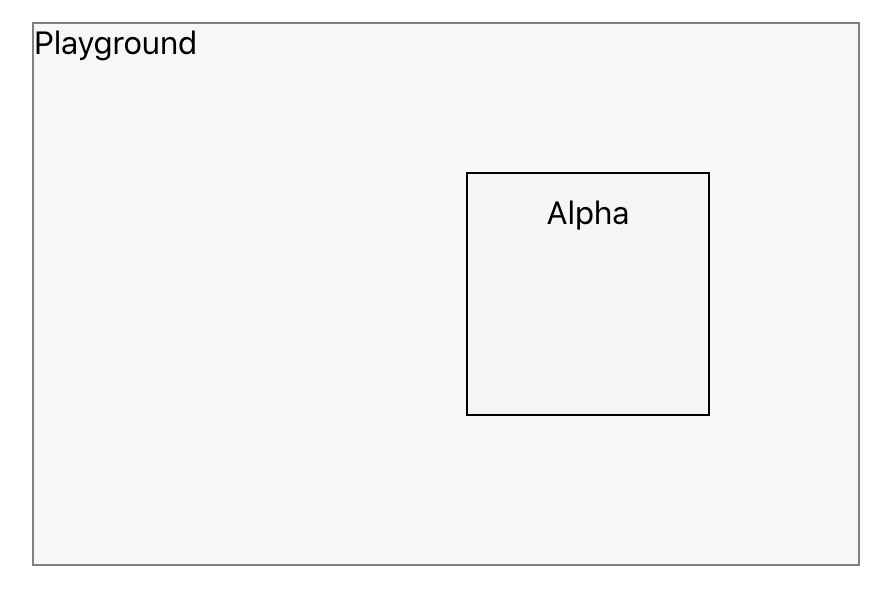

# The Box-sizing Property

Let me tell you a story about a Beta who wished to be an Alpha. Beta was 'beta' because he had a problem, the problem was about him not paying attention to details. One day he decided to meet Alpha and study his structure.


On meeting Alpha, Beta pulled out his inspect tool.


On reading Alpha's properties, he was shocked to find out that both, him and Alpha, had similar properties.

```
.alpha {
  width: 100px;
  height: 100px;
  display: inline-block;
  background-color: whitesmoke;
  padding: 10px;
  margin: 10px;
  border: 1px solid;
}
```

```
.beta {
  width: 100px;
  height: 100px;
  display: inline-block;
  background-color: whitesmoke;
  padding: 10px;
  margin: 10px;
  border: 1px solid;
}
```

Amazed by what he had just discovered he asked Alpha..
**Beta:** _"So what makes you different: I have the same width, height, padding, margin & border, yet you appear different in size and structure, how's that possible ?"_

**Alpha:** _"Are you aware of the reality of Box model"._

**Beta:** _"Nope! Never heard of it"_

Let me show you:

## Box Model

The box model is the basic building block of CSS. Every element in web design is a rectangular box.

Let's look at the structure of the box model: (From top to bottom, order wise)

- Margin
- Border
- Padding
- Content (height and width),

These are all the elements the browser needs in order to render a box model.
With CSS you can control each of them individually.


1. **Margin:**
   Creates space around elements, it is the space outside of any defined borders.
2. **Border:**
   The border surrounds the content, and you don’t have to use it, but it still exists. By default, border has a width of 0px.
3. **Padding:**
   Padding defines the space between the content and the edge of the box.
4. **Content:**
   It represents the actual stuff, text, image, etc. and has a specific width and height.
   Fixed height and width can be set using the height and width of CSS properties, or they can be determined by the content itself.

Read about `inline vs inline-block` to further understand this line: `determined by the content itself` [here](https://github.com/hamza-ghufran/journal/blob/master/content:posts/2020-08-22/index.md)

**Alpha:** _"Beta, Do you know what defines the width of an element ?"_

**Beta:** _" I am listening"_

There is a formula for defining this:

```
width = left margin + left border + left padding + content + right padding + right border + right margin
```


**Alpha:** _"Take out your inspect tool and let's compare our structure properties."_


Alpha's and Beta's box models respectively.

**Alpha:** _"Now do you see it?"_

**Beta:** _" I am not sure"_

Even though your width & height is set to 100px, the actual width & height will be much different.
Going back to our formula:

```
Beta's dimensions:
width & height = 10px + 1px + 10px + 100px + 10px + 1px + 10px => 142px
```

```
Alpha's dimensions:
width & height = 10px + 1px + 10px + 78px + 10px + 1px + 10px => 120px
```

**Alpha:** _"So Beta, while structuring myself I have taken into account the following properties: border, padding, and margin"_

**Alpha:** _"Now probably you are thinking about having to use the calculator every time while structuring yourself, well you can but there is another solution to that or you can say the right way to deal with the problem"_

An important property that’s connected to the box model is the `box-sizing` property.

The box-sizing property defines how the height and width of the element are calculated and if it should include the border and padding.

By default each element has `box-sizing: content-box`

## The evolution of Beta

Alpha lifts the curtain:


**Beta:** _"What the hell! Is that it!!? Let me add that"_

```css
.beta {
  width: 100px;
  height: 100px;
  display: inline-block;
  background-color: whitesmoke;
  padding: 10px;
  margin: 10px;
  border: 1px solid;
  /* The secret to becoming Alpha*/
  box-sizing: border-box;
}
```

If you set `box-sizing: border-box;` on an element, padding and border are included in the width and height


## Purpose

_It is often useful to set box-sizing to border-box to layout elements. This makes dealing with the sizes of elements much easier, and generally eliminates a number of pitfalls you can stumble on while laying out your content._

_Applying box-sizing: border-box to an element changes the box model to a more predictable behavior. Setting height or width will control the size of the entire element, including its padding and border._

_If you have ever been creating a page layout for the web and found yourself doing all kinds of math to figure out how wide or tall you can make things and have them behave properly on the page, then you have encountered what it means to deal with the box model. It is important to understand how margins, borders, padding, and content all work together to create the layout of elements on the page._

# The Position and Z-Index property

Alpha had finally found his apprentice. Time for him to pass down his `alpha knowledge`

### Position Property

**Alpha**: _"Beta, are you familiar with position properties ?"_

**Beta**: _"Naah!"_

So listen carefully:

In our world of the document, whenever an element is inserted/added to this document `position: static` is set as the **default** position property.


Basically what it does is, it tells the element to follow the other elements in the document flow. In other words, the element will stick to the normal page flow.

```html
<div>1</div>
<div>2</div>
<div>3</div>
```

div 1 will always be rendered **above** 2 and so on, you get it!!. This flow is what we are mainly used to.

But there is a catch, the following properties will never have any effect on an element having **static as the positioning property**.

- [left](https://css-tricks.com/almanac/properties/l/left/)
- [right](https://css-tricks.com/almanac/properties/r/right/)
- [top](https://css-tricks.com/almanac/properties/t/top/)
- [bottom](https://css-tricks.com/almanac/properties/b/bottom/)
- [z-index](https://css-tricks.com/almanac/properties/z/z-index/)

#### Introducing `position: relative` property

This acts exactly like the static positioning property but, it does react to the above-listed CSS properties.

**Alpha:** _" Let's go to (within) the playground and try out these spells"_

**The Playground**

```css
.playground {
  padding: 64px;
  margin-top: 100px;
  /** Position set as relative to help map the Playground text to the top [Read about: position absolute]*/
  position: relative;
  border: 1px solid grey;
  display: inline-block;
  background-color: #f7f7f7;
}
```

Alpha & Beta both set their position properties as `relative`


**Alpha:** _"You feel no difference, right?"_

**Beta:** _"Yup, all the same"_

**Alpha:** _"Alright, try this spell - `z-index: -1`"_


**Beta:** _" WAY NO!!! I am invisible"_

**Alpha:** _" Not exactly, you're just below the playground now, or I may say, the playground is over you, ;)"_

**Alpha:** _"Reset `z-index: 0` now. Moving ahead, similarly, by altering my `left` & `z-index` property, I can place myself above you"_

```css
.alpha {
   ...
    position: relative;
    left: 142px;
    z-index: 1;
}

.beta{
    position: relative;
}
```



**Beta:** _"So this is how they design their pretty websites with there pretty png(s) floating on top of each other, hmm.."_

**Alpha:** _"Well... Another spell exist which can make you transcend this document flow, and you can chill anywhere on the page while having your feet planted withing a container"_

#### Introducing `position: absolute` property

In this case, the property completely removes the element from the document flow and everything renders as if that document did not exist at all.

This is extremely helpful when you want to stick the element in someplace and don't want anything around it to be affected by its presence.

Going back to the playground...

```Css
.playground{
  padding: 64px;
  margin-top: 100px;
  border: 1px solid grey;
  display: inline-block;
  background-color: #f7f7f7;
  /** Position relative removed*/
}
```

**Alpha:** _"Try this spell `position: absolute`"_

```css
.beta{
  ...
  top: 0px;
  left: 0px;
  margin: 10px;
  position: absolute;
}
```


**Beta:** _"I have completely escaped from the playground, how is that-? Should I not be placed on the top left corner like how the playground text was placed. Since I have top & left set to 0"_

**Alpha:** _"Incorrect, the absolute property makes the element respond not to the dimensions of its parent (playground), but the document itself:"_

**Beta:** _''So how do I make myself positioned absolutely from my parent element (playground)"_

**Alpha:** _"You set the parent (playground) as `position: relative`"_

```css
.playground{
  ...
  position: relative;
}
```


**Alpha:** _"Now that you've got a sense of this, let's explore further"_

**Beta:** zZ 😴

#### Introducing `position: fixed` & `position: sticky`

**Alpha:** _"You see these users, scrolling all day long, Don't you wanna just stick to their screen and irritate them!!"_

**Beta:** _"We can do that.."_

The `fixed` value is similar to `absolute` as it can help you position an element anywhere relative to the document. This value is unaffected by scrolling.

```css
.beta{
  ...
  position: fixed;
}
```


**Beta:** _"Bumpy Ride"_

**Alpha:** "It only lacks the surprise element. I mean, as soon as the user starts scrolling, the element scrolls along"

**Alpha:** "_Do you think we can achieve something like_: **_once a user has scrolled past a certain point in the viewport, fix the position of the element to that location so it remains persistently displayed like an element with a `fixed` value._**"

**Beta:** _"Sticky.....easy guess 😏 "_

```
.beta{
   ...
   position: sticky;
}
```

**Alpha:** _" Since you know that already and an easy guess as well would be that we also use this property to stick navbars to the screen while the user is scrolling, Let's try something else with this. Write a spell which make you move within the playground when the user scrolls"'_

Assessing sticky position property to child elements can be tricky: Check [this](https://stackoverflow.com/questions/53131200/why-sticky-position-does-not-work-in-child-div) out.

```css
.playground{
  ...
  height: 200px;
}

.beta{
  position: sticky;
  top: 50px;
}
```


The Beta element will be relatively positioned until the scroll location of the viewport reaches a point where the element will be `50px` from the top of the viewport. At that point, Beta becomes sticky and remains at a `fixed` position `50px` top of the screen.

### Wrapping Up

**Performance & Accessibility** [MDN](https://developer.mozilla.org/en-US/docs/Web/CSS/position#:~:text=The%20position%20CSS%20property%20sets,final%20location%20of%20positioned%20elements.)

_Scrolling elements containing `fixed` or `sticky` content can cause performance and accessibility issues. As a user scrolls, the browser must repaint the sticky or fixed content in a new location. Depending on the content needing to be repainted, the browser performance, and the device's processing speed, the browser may not be able to manage repaints at 60 fps, causing accessibility concerns for people with sensitivities and jank for everyone. One solution is to add [`will-change: transform`](https://developer.mozilla.org/en-US/docs/Web/CSS/will-change) to the positioned elements to render the element in its own layer, improving repaint speed and therefore improving performance and accessibility._
